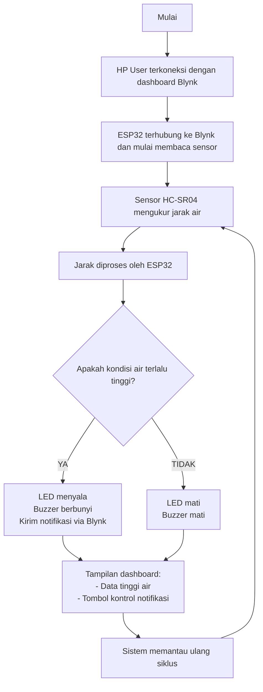

# 🚨 Flood Monitoring System with Blynk & ESP32

Sistem ini merupakan proyek simulasi **monitoring ketinggian air** menggunakan **ESP32**, **sensor ultrasonik HC-SR04**, serta integrasi **dashboard Blynk** sebagai media visualisasi dan kontrol jarak jauh. Sistem dirancang untuk mendeteksi potensi banjir secara real-time dan memberikan notifikasi kepada pengguna melalui aplikasi Blynk saat ketinggian air melebihi ambang batas yang telah ditentukan.

## 🛠️ Fitur Utama
- Deteksi ketinggian air menggunakan HC-SR04
- Kirim notifikasi otomatis ke HP pengguna via Blynk saat tinggi air melebihi batas
- Tampilan data ketinggian air real-time di dashboard Blynk 
- Kontrol manual notifikasi melalui tombol virtual 
- Aktivasi otomatis LED dan buzzer sebagai alarm lokal saat terjadi kenaikan air

## 🔧 Komponen yang Digunakan
- ESP32 Dev Board
- Sensor Ultrasonik HC-SR04
- LED indikator (merah)
- Buzzer
- Aplikasi Blynk
- WiFi (simulasi menggunakan Wokwi)
- Website Wokwi (simulasi sistem dijalankan secara virtual)

---
### Link wokwi:
https://wokwi.com/projects/425367547353631745

## 🔄 Cara Kerja Sistem

Note:
- Project lomba PKM AI OIM FTUI 2025
- project dijalankan menggunakkan website wokwi langsung

